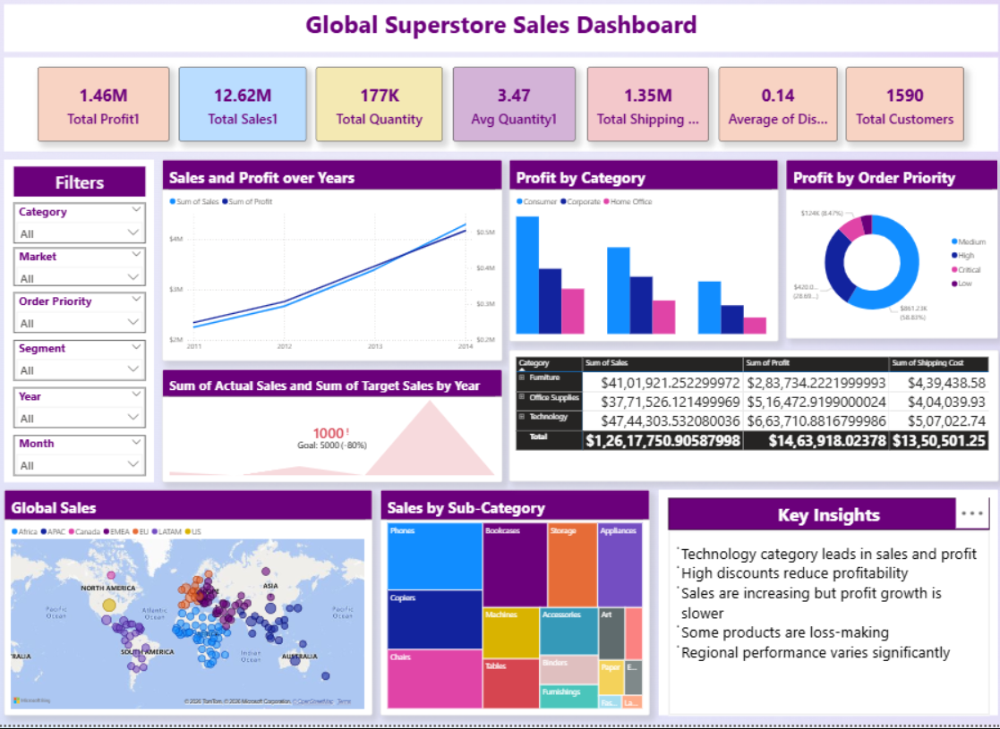

# Global Superstore Sales Analysis

## Overview
Analyzed 9,000+ row global sales dataset across 
multiple regions, categories, and years to uncover 
revenue trends and profitability patterns.

## Tools Used
Excel · SQL · Power BI · DAX

## Dataset
- 1,590 Total Customers
- 3 Categories: Furniture, Office Supplies, Technology
- Markets: Africa, APAC, Canada, EMEA, EU, LATAM, US
- Years: 2011 – 2014

## Dashboard Preview

## Key Insights
- **Total Sales: $12.62M** with Total Profit of $1.46M
- **Technology leads in both sales ($47.44M) and 
  profit ($6.63M)** among all categories
- **Sales grew consistently 2011–2014** but profit 
  growth is slower — high discounts are reducing 
  margins
- **Average discount: 0.14** — some products are 
  being sold at a loss due to heavy discounting
- **Medium priority orders dominate** profit 
  contribution, followed by Critical orders
- **Regional performance varies significantly** — 
  global map shows uneven sales distribution
- **Phones, Machines, and Chairs** are top 
  sub-categories by sales volume

## Impact
Identified discount-driven margin loss and 
category-level profitability gaps — insights used 
to inform inventory and pricing strategy decisions

## Recommendations
- Reduce discounts on low-margin products
- Focus marketing on Technology category
- Investigate loss-making products and discontinue 
  or reprice them
- Replicate high-performing region strategies globally
